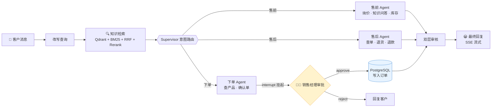

# 纺织 B2B 交易智能体 Agent

> 客户说「羽绒服用什么面料」「T400 黑色多少钱」「我要退货」→ 系统自动路由到售前 / 下单 / 售后 Agent，
> 跑通 **询价 → 知识问答 → 下单（人工审批）→ 查单 → 退款** 的交易闭环。
> 不是"回答问题"的客服，是"完成业务"的 Agent。


> 📖 架构从零讲解见 [docs/UNDERSTANDING.md](docs/UNDERSTANDING.md)；生产化改造明细见 [PRODUCTION_MIGRATION_CHECKLIST.md](PRODUCTION_MIGRATION_CHECKLIST.md)。

---

## 🖥️ 界面展示

**完整下单路线**：客户询价 → 生成确认单 → HITL 挂起待审批 → 审批通过生成订单

<p align="center">
  
</p>

---

## ✨ 功能亮点

- **多 Agent 架构** — Supervisor 三分支路由（售前 / 下单 / 售后），状态机 + LLM 意图分类
- **混合检索 RAG** — Qdrant 向量 + BM25 关键词 + RRF 融合 + CrossEncoder Rerank（企业级演进：ChromaDB → Qdrant，LocalMode/独立服务一份代码）
- **结构化产品查询** — PostgreSQL 281 条产品（SQLAlchemy async + asyncpg 连接池）
- **HITL 支付审批** — 下单经 LangGraph `interrupt` 挂起，销售人工审批通过才写库（`/approval/approve|reject`）
- **节点事件流式** — 图执行过程（改写→检索→路由→应答→审核）经 SSE 实时推给前端
- **完整下单流程** — 查产品 → 人工审批 → 写入订单
- **售后处理** — 查订单 → 对照退货规则 → 生成退款工单
- **双层审核** — 规则快速拦截 + LLM 安全审查
- **三层记忆** — Redis 热缓存（可选）+ PostgreSQL 对话存档（user_id 行级隔离）+ Qdrant 长期偏好
- **双凭证鉴权** — 短期 access（JWT 15 分钟，无状态）+ **可轮换 refresh**（Redis 存哈希、
  每次刷新轮换、旧 token 重放判定重用即注销整个会话）；`users.token_version` + 60s 读穿缓存
  让改密码/封号/全端下线**秒级生效**；Redis 不可用时登录刷新 **fail-closed 503**
- **限流与审计** — Redis 令牌桶（登录 IP / 账号+IP 失败 / 注册 / 刷新 / 聊天 / 分析）；
  管理动作与敏感读取全部写 `audit_log`
- **管理员数据分析 Agent** — 一句话中文提问 → 规划 → **只读 SQL**（独立只读角色 +
  事务只读 + 语句校验强制 LIMIT + 结果封顶，四层防护）→ 自纠错 → 结论（数字逐个回查证据，
  查无出处自动降级为"谨慎采信"）→ 声明式图表（**数值由程序填，模型编不了**）
- **管理端工作台** — 全站订单（筛选/分页）、订单**状态机**流转、退款审核、经营指标；
  管理员界面与客户端按角色分界面（侧栏管理导航 + "客户视角"入口）
- **退单联动** — 退款工单与订单状态打通：建单 → 订单「退款中」，通过 → 「已退款」（退款前
  未付款则「已取消」），驳回 → **原样退回**；工单与订单同事务，不变量可自检
- **租户边界** — 订单级工具按 `order_no + customer_id` 校验归属，身份由服务端**覆盖注入**
  （不是提示词约束），缺身份 fail-closed
- **官方 MCP SDK** — 四个工具 Server（产品/订单/售后/只读分析）用 FastMCP，客户端用官方 `mcp` SDK（ClientSession + stdio_client 异步）管理子进程生命周期
- **数据完整性** — 金额 `numeric` 精确到分、7 条外键（RESTRICT/CASCADE 按业务语义分开）、
  演示数据与治理脚本（清理/回填全部 dry-run 默认 + 审计留痕）
- **全链路异步** — LangGraph `ainvoke`、节点 async、LLM `astream` 单事件循环（企业级演进）
- **评估体系** — 检索消融 85 题 + 端到端规则 25 题 + LLM-as-Judge 四维 (11/11) +
  **数据分析 9 题**（带参考 SQL 的真值、题目/结果/数字/编造四个维度自动判分，当前 9/9）
- **测试与 CI** — pytest 251 条 + 前端 4 套 Node 测试；GitHub Actions 起 PostgreSQL/Redis
  容器跑全量（最近一次 success）

## 快速开始

```bash
# 0. 前置：PostgreSQL（本机默认当前系统用户）与 .env
#    - 业务库：postgresql+asyncpg://<用户>@localhost:5432/study1（不设 DATABASE_URL 时默认）
#    - 向量库：Qdrant 用 LocalMode（index/qdrant_storage，零外部服务）；生产设 QDRANT_URL 指向独立服务
#    - .env 里配 DEEPSEEK_API_KEY / DEEPSEEK_BASE_URL

# 1. 安装依赖（Python >= 3.10，建议 3.12）
pip install -r requirements.txt

# 2. 初始化 PostgreSQL 业务库（建表 + 迁移 SQLite 旧数据，幂等）
python scripts/migrate_sqlite_to_pg.py

# 3. 构建知识库索引（写入 Qdrant，bge-base-zh 本地模型）
python scripts/build_index.py

# 4. 终端运行
python src/agent.py

# 5. Web 界面
python app.py
# 打开 http://127.0.0.1:8005
```

> 登录：Web 端用账号密码注册/登录（`POST /auth/register|login`）拿双凭证，前端自动带
> `Authorization: Bearer`。**旧的 `X-User-Id` 请求头回退已在 2026-09 移除** ——
> 那个机制允许任意冒充（请求头写谁就是谁），现在无 token 一律 401。

> 鉴权（2026-08）：管理端点（`/approval/*`）已加 JWT 鉴权（无 token 401 / 非管理员 403），审批动作写 `audit_log` 审计表。
>
> **跨租户越权修复（2026-09）**：订单级 MCP 工具（`query_order` / `query_order_status` /
> `create_refund`）此前**不校验调用者归属** —— 身份只写在提示词里，实测普通客户账号即可
> 读取他人订单的电话地址、在他人订单上建退款工单（并把它推进「退款中」）、
> 用提示词注入把订单记到别人名下。现在调用侧由服务端**覆盖注入**可信身份
> （`src/order_access.py`，三处调度点统一走），工具侧按 `order_no + customer_id` 查询、
> 缺身份 fail-closed、"不存在"与"不属于您"返回同一句话（不泄露订单存在性）。
> 回归用例 `tests/test_cross_tenant_access.py`。附带审计结论：业务接口全部有鉴权，
> 公开端点只有注册/登录/刷新/登出、`/healthz` 与 `/docs`（生产建议关掉 docs）。
>
> **管理端工作台（2026-09）**：补上原本**一个都没有**的管理侧接口 —— 管理员能看到
> **全站订单**（`/admin/orders`：状态/关键词筛选 + 分页；关键词覆盖订单号、客户 ID 与昵称、
> 产品编号与名称）、按**订单状态机**推进流转（`/admin/orders/{no}/status`：
> 待付款→已付款→已发货→已收货，可取消；跳步与终态再改一律 400，付款/发货顺手补
> `paid_at`/`shipped_at`，让分析模块的时效指标有数据）、**审核退款工单**
> （`/admin/refunds` + `/{id}/decide`：CAS 保证同一工单只能审一次，落审核人/时间/备注）、
> 以及工作台指标 `/admin/orders/summary`（待审批/待发货/退款待审/未付款/本月 GMV/近 7 天趋势）。
>
> **退单联动（2026-09 第二轮）**：退款工单与订单状态打通 —— 售后 Agent 建单即把订单置为
> 「退款中」并记下退款前状态，管理端审核通过置「已退款」（退款前是待付款则「已取消」，
> 没付过钱的不叫退款）、驳回则**原样退回**（该单还有未决工单时不退）。「退款中」是闸门状态，
> 只能由工单离开，杜绝"货也发了、款也退了"。工单与订单写在**同一个事务**里，
> 不变量"有未决工单 ⇒ 订单退款中"由 `check_refund_invariants()` 自检（回填脚本与测试共用）。
> 分析口径随之落地：GMV 含已退款/退款中，净成交额才扣已退款，并区分
> **退款率（已退款订单占比）** 与 **退款申请率（含被驳回的工单占比）** —— 实测两者差 2.25 倍。
> 存量回填脚本 `scripts/backfill_refund_linkage.py`（默认 dry-run，单事务 + 审计）。
> 所有写操作写审计。前端按角色分界面：管理员默认落在**经营工作台**，侧栏是管理导航
> （工作台 / 订单管理 / 退款审核 / 订单审批 / 用户管理 / 数据分析），"客户视角"放在最底部；
> 客户界面不变。管理端页面全部懒加载，不进客户 bundle。
>
> **管理员数据分析 Agent（2026-09）**：一句话中文问题 → 规划 → **只读 SQL**（四层防护：
> 只读角色 / 事务只读 / 语句校验+强制 LIMIT / 结果封顶）→ 自纠错（≤2 次）→ 结论（数字逐个
> 回查结果集，查无出处进「数据局限声明」）→ 声明式图表 spec（**图表数值由程序填，模型编不了**）
> → 前端 ECharts 懒加载渲染。配套：语义层（无外键库的 JOIN 依据 + GMV/退款率口径）、
> 造数脚本、脏数据修复、7 条带参考 SQL 的评测用例（`scripts/eval_analytics.py`）。
>
> 安全加固（2026-09）：`/auth/*` 限流（Redis 令牌桶：同 IP 登录 20 次/分钟、
> 同 账号+IP 失败 5 次/15 分钟锁定、注册 10 个/小时 → 429 + Retry-After）、
> **秒级吊销**（`users.token_version` + 60s 读穿缓存：改密码/封号/全端下线后
> 已签发的 access token 立刻失效）、改密码与封号接口
> （`/auth/change-password`、`/auth/logout-all`、`/admin/users/{uid}/status`）、审计留痕；
> 业务接口 `/chat` 按 **user_id** 限流（30 条/分钟，SSE 在建流前判定）。
> 改密码有前端弹窗（顶栏钥匙图标），改完当前设备保持登录、其他设备全被登出。
>
> 凭证体系（2026-09 路线②）：**短期 access（JWT，15 分钟，无状态）+ 可轮换 refresh（Redis，可撤销）**。
> refresh 轮换 + 重用检测（旧 token 被重放即注销整个会话）+ 空闲期/绝对上限双封顶；
> 登出、踢设备、会话列表都走服务端。Redis 不可用时登录/刷新 **fail-closed 返回 503**
> （鉴权不能 fail-open），已签发的 access 在 15 分钟内仍有效。
> `GET /me` 返回当前身份（前端据此显隐审批入口）；`POST /dev/login`（仅 `DEV_MODE=1` 注册）支持切换客户/管理员身份（mock 微信身份）。
> 生产接入企业微信 OAuth 后，`/dev/login` 一并移除（`X-User-Id` 回退已于 2026-09 移除）。

## 架构



**存储**：业务数据 → PostgreSQL（products 281 条 / orders 602 单 / refunds / pending_approvals / conversations / profile / audit_log）；知识 → Qdrant 集合 `textile_knowledge`（142 条）+ BM25 索引；Embedding/Rerank → BAAI bge 本地模型。图执行过程经 SSE 实时推给前端（节点事件流式）。

## 评估

| 指标 | 得分 |
|------|:--:|
| 检索 Hit@3 | 100% |
| 检索 MRR（混合+Rerank，Qdrant 版） | 0.959 |
| 端到端通过率（规则断言） | 100% (25/25) |
| LLM-as-Judge 通过率 | 100% (11/11) |
| Judge 维度均分 | relevance 5.0 / completeness 4.55 / factual 5.0 / safety 5.0 / overall 4.82 |

详见 [EVALUATION.md](EVALUATION.md)

## 部署

```bash
# Docker（首次构建下载本地推理模型约 600MB）
docker compose up --build

# 跳过模型下载，挂载本地 HF 缓存
docker compose up --build --build-arg DOWNLOAD_MODELS=0 \
  -v ~/.cache/huggingface:/root/.cache/huggingface
```

- 健康检查：`GET /healthz`（存活 + 任务队列计量）
- 审批端点：`GET /approval/pending`、`POST /approval/approve`、`POST /approval/reject`
- CI：`.github/workflows/ci.yml`（push/PR 自动跑测试 + 前端构建）

## 日志与追踪

日志（logging）与追踪（LangSmith）互补，一个回答「发生了什么」，一个回答「这次请求怎么走的」。

| 机制 | 回答的问题 | 查看方式 |
|------|-----------|---------|
| 日志 | 程序状态、错误、警告（进程级） | `logs/app.log` + stderr |
| 追踪 | 每次请求的执行树、token、耗时（请求级） | LangSmith 网页 |

### 日志

统一配置在 `src/logging_config.py`，各模块用 `get_logger(__name__)` 获取，级别 `DEBUG < INFO < WARNING < ERROR`。

- 输出到 stderr + `logs/app.log`（滚动，5MB × 3 备份）
- 默认 INFO，调详细程度：`LOG_LEVEL=DEBUG python src/agent.py`（或 `.env` 加 `LOG_LEVEL=DEBUG`）
- 排查示例：`grep "Supervisor" logs/app.log` 看路由、`grep -E "WARNING|ERROR" logs/app.log` 看异常

### 追踪（LangSmith）

`.env` 配置 `LANGSMITH_TRACING=true` + `LANGSMITH_API_KEY` + `LANGSMITH_PROJECT`，LLM / 工具调用自动 trace；`review_response`、`retrieve` 用 `@traceable` 手动标注。打开 https://smith.langchain.com 看 trace 树。

排查流程：先用日志定位「哪个环节有问题」，再用 LangSmith 点开该环节看输入输出细节。

## 项目结构

```
src/
├── agent.py              主图 + 售前 Agent（编译带 checkpointer，HITL 依赖）
├── order_agent.py         下单 Agent（create_order 前人工审批）
├── after_sales_agent.py   售后 Agent
├── retrieval.py           混合检索器（Qdrant + BM25 + RRF + Rerank）
├── vector_store.py        Qdrant 访问层（LocalMode / 独立服务双模式）【新】
├── db.py                  PostgreSQL 访问层（SQLAlchemy async + asyncpg 连接池）【新】
├── memory.py              用户记忆系统（Redis 热缓存 + PG 存档 + Qdrant 偏好）
├── mcp_client.py          MCP 客户端（官方 mcp SDK：ClientSession + stdio_client 异步）
├── stream_chat.py         SSE：节点事件流 + 最终回复 + 挂起事件
├── user_identity.py       user_id 校验（单一事实来源）
├── approval.py            待审批订单注册表（HITL）
├── task_queue.py          有界任务队列（替代裸线程）
├── node_events.py         图节点事件描述（流式可视化）
├── eval_cases.py          端到端评测共享用例集
├── logging_config.py      统一日志配置
└── mcp_servers/           工具服务层 (product/order/refund，FastMCP 异步版)
scripts/
├── build_index.py         构建 Qdrant + BM25 索引
├── migrate_sqlite_to_pg.py SQLite 旧数据 → PostgreSQL 迁移（幂等，含 serial 序列重置）【新】
├── eval_retrieval.py      检索消融评测 (85题)
├── eval_agent.py          端到端规则评测 (25题)
└── eval_judge.py          LLM-as-Judge 四维评分评测
docker-compose.yml / Dockerfile / .github/workflows/ci.yml   部署与 CI（postgres + qdrant 服务）
docs/UNDERSTANDING.md      改造后架构从零讲解
index/                    索引文件 (auto-gen：bm25 + qdrant_storage)
data/
├── knowledge.txt          纺织知识库源文件
├── chunks.json            知识切片（建索引用）
├── products.db            旧 SQLite 产品库（迁移源，已迁 PG）
├── orders.db              旧 SQLite 订单库（迁移源，已迁 PG）
└── users/                 旧用户记忆（迁移源）
```
