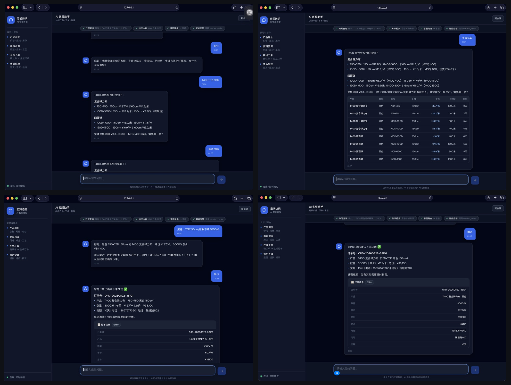
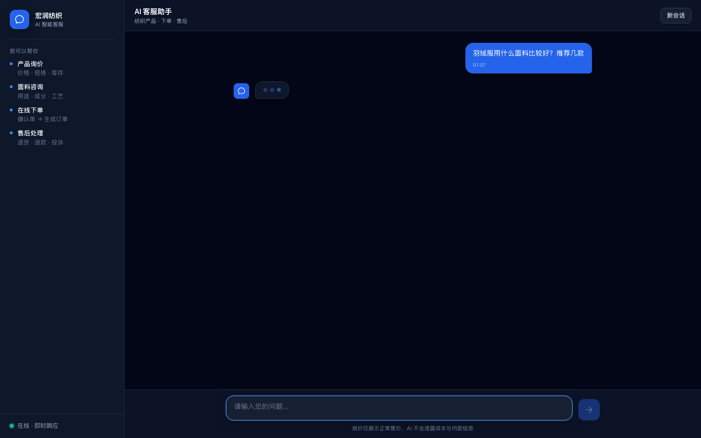
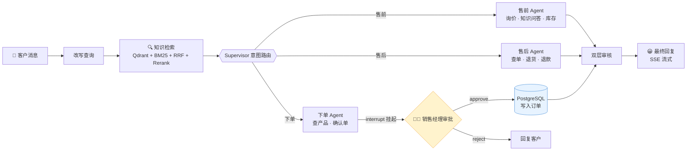

# 纺织 B2B 交易智能体 Agent

> 客户说「羽绒服用什么面料」「T400 黑色多少钱」「我要退货」→ 系统自动路由到售前 / 下单 / 售后 Agent，
> 跑通 **询价 → 知识问答 → 下单（人工审批）→ 查单 → 退款** 的交易闭环。
> 不是"回答问题"的客服，是"完成业务"的 Agent。


> 📖 架构从零讲解见 [docs/UNDERSTANDING.md](docs/UNDERSTANDING.md)；生产化改造明细见 [PRODUCTION_MIGRATION_CHECKLIST.md](PRODUCTION_MIGRATION_CHECKLIST.md)。

---

## 🖥️ 界面展示

**完整下单路线**：客户询价 → 生成确认单 → HITL 挂起待审批 → 审批通过生成订单

<p align="center">
  
</p>

<p align="center">
  
</p>

---

## ✨ 功能亮点

- **多 Agent 架构** — Supervisor 三分支路由（售前 / 下单 / 售后），状态机 + LLM 意图分类
- **混合检索 RAG** — Qdrant 向量 + BM25 关键词 + RRF 融合 + CrossEncoder Rerank（企业级演进：ChromaDB → Qdrant，LocalMode/独立服务一份代码）
- **结构化产品查询** — PostgreSQL 281 条产品（SQLAlchemy async + asyncpg 连接池）
- **HITL 支付审批** — 下单经 LangGraph `interrupt` 挂起，销售人工审批通过才写库（`/approval/approve|reject`）
- **节点事件流式** — 图执行过程（改写→检索→路由→应答→审核）经 SSE 实时推给前端
- **完整下单流程** — 查产品 → 人工审批 → 写入订单
- **售后处理** — 查订单 → 对照退货规则 → 生成退款工单
- **双层审核** — 规则快速拦截 + LLM 安全审查
- **三层记忆** — Redis 热缓存（可选）+ PostgreSQL 对话存档（user_id 行级隔离）+ Qdrant 长期偏好
- **多用户隔离** — `X-User-Id` 请求头按用户隔离历史/偏好/订单（`src/user_identity.py` 单一校验源）
- **官方 MCP SDK** — 三个工具 Server 用 FastMCP 重写，客户端用官方 `mcp` SDK（ClientSession + stdio_client 异步）管理子进程生命周期
- **全链路异步** — LangGraph `ainvoke`、节点 async、LLM `astream` 单事件循环（企业级演进）
- **评估体系** — 检索消融评测 85 题 + 端到端规则评测 25 题（五类场景：售前/下单/售后/闲聊/安全）+ LLM-as-Judge 四维评分 (25/25)

## 快速开始

```bash
# 0. 前置：PostgreSQL（本机默认当前系统用户）与 .env
#    - 业务库：postgresql+asyncpg://<用户>@localhost:5432/study1（不设 DATABASE_URL 时默认）
#    - 向量库：Qdrant 用 LocalMode（index/qdrant_storage，零外部服务）；生产设 QDRANT_URL 指向独立服务
#    - .env 里配 DEEPSEEK_API_KEY / DEEPSEEK_BASE_URL

# 1. 安装依赖（Python >= 3.10，建议 3.12）
pip install -r requirements.txt

# 2. 初始化 PostgreSQL 业务库（建表 + 迁移 SQLite 旧数据，幂等）
python scripts/migrate_sqlite_to_pg.py

# 3. 构建知识库索引（写入 Qdrant，bge-base-zh 本地模型）
python scripts/build_index.py

# 4. 终端运行
python src/agent.py

# 5. Web 界面
python app.py
# 打开 http://127.0.0.1:8005
```

> 多用户：Web 请求带请求头 `X-User-Id`（前端自动处理）；非法值返回 400，缺省降级 `guest`。

## 架构



**存储**：业务数据 → PostgreSQL（products 281 条 / orders / refunds / conversations / profile）；知识 → Qdrant 集合 `textile_knowledge`（142 条）+ BM25 索引；Embedding/Rerank → BAAI bge 本地模型。图执行过程经 SSE 实时推给前端（节点事件流式）。

## 评估

| 指标 | 得分 |
|------|:--:|
| 检索 Hit@3 | 100% |
| 检索 MRR（混合+Rerank，Qdrant 版） | 0.959 |
| 端到端通过率（规则断言） | 100% (25/25) |
| LLM-as-Judge 通过率 | 100% (25/25) |
| Judge 维度均分 | relevance 5.0 / completeness 4.55 / factual 5.0 / safety 5.0 / overall 4.82 |

详见 [EVALUATION.md](EVALUATION.md)

## 部署

```bash
# Docker（首次构建下载本地推理模型约 600MB）
docker compose up --build

# 跳过模型下载，挂载本地 HF 缓存
docker compose up --build --build-arg DOWNLOAD_MODELS=0 \
  -v ~/.cache/huggingface:/root/.cache/huggingface
```

- 健康检查：`GET /healthz`（存活 + 任务队列计量）
- 审批端点：`GET /approval/pending`、`POST /approval/approve`、`POST /approval/reject`
- CI：`.github/workflows/ci.yml`（push/PR 自动跑测试 + 前端构建）

## 日志与追踪

日志（logging）与追踪（LangSmith）互补，一个回答「发生了什么」，一个回答「这次请求怎么走的」。

| 机制 | 回答的问题 | 查看方式 |
|------|-----------|---------|
| 日志 | 程序状态、错误、警告（进程级） | `logs/app.log` + stderr |
| 追踪 | 每次请求的执行树、token、耗时（请求级） | LangSmith 网页 |

### 日志

统一配置在 `src/logging_config.py`，各模块用 `get_logger(__name__)` 获取，级别 `DEBUG < INFO < WARNING < ERROR`。

- 输出到 stderr + `logs/app.log`（滚动，5MB × 3 备份）
- 默认 INFO，调详细程度：`LOG_LEVEL=DEBUG python src/agent.py`（或 `.env` 加 `LOG_LEVEL=DEBUG`）
- 排查示例：`grep "Supervisor" logs/app.log` 看路由、`grep -E "WARNING|ERROR" logs/app.log` 看异常

### 追踪（LangSmith）

`.env` 配置 `LANGSMITH_TRACING=true` + `LANGSMITH_API_KEY` + `LANGSMITH_PROJECT`，LLM / 工具调用自动 trace；`review_response`、`retrieve` 用 `@traceable` 手动标注。打开 https://smith.langchain.com 看 trace 树。

排查流程：先用日志定位「哪个环节有问题」，再用 LangSmith 点开该环节看输入输出细节。

## 项目结构

```
src/
├── agent.py              主图 + 售前 Agent（编译带 checkpointer，HITL 依赖）
├── order_agent.py         下单 Agent（create_order 前人工审批）
├── after_sales_agent.py   售后 Agent
├── retrieval.py           混合检索器（Qdrant + BM25 + RRF + Rerank）
├── vector_store.py        Qdrant 访问层（LocalMode / 独立服务双模式）【新】
├── db.py                  PostgreSQL 访问层（SQLAlchemy async + asyncpg 连接池）【新】
├── memory.py              用户记忆系统（Redis 热缓存 + PG 存档 + Qdrant 偏好）
├── mcp_client.py          MCP 客户端（官方 mcp SDK：ClientSession + stdio_client 异步）
├── stream_chat.py         SSE：节点事件流 + 最终回复 + 挂起事件
├── user_identity.py       user_id 校验（单一事实来源）
├── approval.py            待审批订单注册表（HITL）
├── task_queue.py          有界任务队列（替代裸线程）
├── node_events.py         图节点事件描述（流式可视化）
├── eval_cases.py          端到端评测共享用例集
├── logging_config.py      统一日志配置
└── mcp_servers/           工具服务层 (product/order/refund，FastMCP 异步版)
scripts/
├── build_index.py         构建 Qdrant + BM25 索引
├── migrate_sqlite_to_pg.py SQLite 旧数据 → PostgreSQL 迁移（幂等，含 serial 序列重置）【新】
├── eval_retrieval.py      检索消融评测 (85题)
├── eval_agent.py          端到端规则评测 (25题)
└── eval_judge.py          LLM-as-Judge 四维评分评测
docker-compose.yml / Dockerfile / .github/workflows/ci.yml   部署与 CI（postgres + qdrant 服务）
docs/UNDERSTANDING.md      改造后架构从零讲解
index/                    索引文件 (auto-gen：bm25 + qdrant_storage)
data/
├── knowledge.txt          纺织知识库源文件
├── chunks.json            知识切片（建索引用）
├── products.db            旧 SQLite 产品库（迁移源，已迁 PG）
├── orders.db              旧 SQLite 订单库（迁移源，已迁 PG）
└── users/                 旧用户记忆（迁移源）
```
